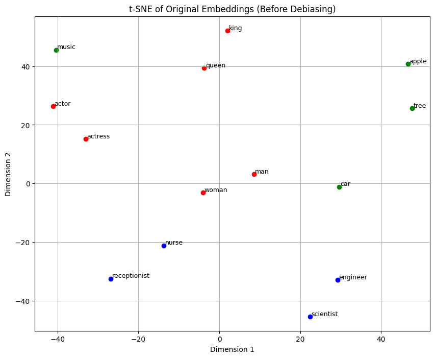
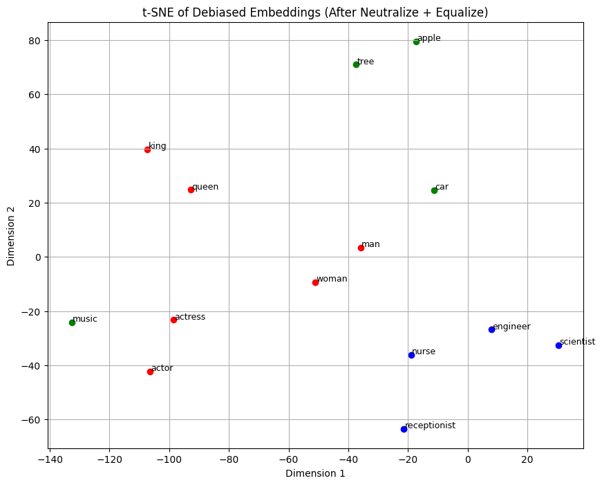

# Word Embedding Debiasing: Understanding and Mitigating Bias in NLP

This project explores how **word embeddings**, while powerful for capturing semantic relationships in natural language, can also **encode social biases** — particularly **gender bias**.
We apply the **Hard Debiasing algorithm** proposed by Bolukbasi et al. (2016) to analyze and mitigate this issue in pretrained word vectors.

---

## Why Word Embeddings?

Word embeddings (e.g., **GloVe**, **Word2Vec**, **fastText**) are widely used in **Natural Language Processing (NLP)** and **Large Language Models (LLMs)**. They represent words as dense vectors in high-dimensional space, allowing models to understand similarities and analogies between words.

For example:

```text
"king" - "man" + "woman" ≈ "queen"
```

This arithmetic shows how embeddings capture relationships — but they can also reflect societal stereotypes (e.g., "programmer" closer to "man" than "woman").

---

## Project Overview

We demonstrate and mitigate bias in word embeddings using the **Hard Debiasing algorithm**. This includes:

* **Visualizing relationships** with cosine similarity and t-SNE
* Performing **word analogy tasks**
* Applying **neutralization** to debias neutral words (e.g., "scientist")
* Applying **equalization** to balance gendered pairs (e.g., "actor" ↔ "actress")

---

## Project Structure

* `debiasing_word_embeddings.ipynb`: Main notebook with all analysis, debiasing steps, and visualizations
* `utils.py`: Helper functions
* `images/`: Folder containing visual aids for cosine similarity, neutralization, and equalization
* `dataset/glove.6B.50d.txt`: Pretrained GloVe word vectors (assumed loaded into `word_to_vec_map`)

---

## Approach

We use the **Hard Debiasing method**:

1. **Compute a bias direction** (e.g., "woman" - "man") from gendered word pairs.
2. **Neutralize** the bias from neutral words by removing components along the gender direction.
3. **Equalize** gender-specific word pairs so that they remain distinct but balanced across the gender axis.

We evaluate the effects of debiasing using:

* Cosine similarity comparisons
* Word analogy completions
* t-SNE visualizations before and after debiasing

---

## Visualization Example

We visualize original and debiased embeddings using **t-SNE**:

### Before Debiasing



Notice how **neutral words** (like *receptionist*, *nurse*) cluster close to gendered terms — revealing bias.

### After Debiasing



After applying **neutralization** and **equalization**, neutral words move away from the gender axis, and gendered pairs become more symmetric.

---

## Key Techniques

* **Cosine Similarity**: Measures how similar two word vectors are.
* **Word Analogy Tasks**: Solves analogies like *"man" is to "woman" as "king" is to \_\_\_*.
* **Linear Algebra**: Projections and vector manipulation for debiasing.

---

## Requirements

```bash
pip install numpy matplotlib scikit-learn tqdm
```

---

## References

* [Bolukbasi et al. (2016)](https://papers.nips.cc/paper/6228-man-is-to-computer-programmer-as-woman-is-to-homemaker-debiasing-word-embeddings.pdf) — *"Man is to Computer Programmer as Woman is to Homemaker? Debiasing Word Embeddings"*
* [GloVe Embeddings](https://nlp.stanford.edu/projects/glove/)
* t-SNE: van der Maaten & Hinton, 2008

